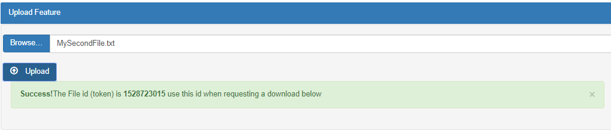

The Asset (file) Manager app is made up of a static web frontend with lambda
functions serving the backend.

The user lands on the index.html page and from there proceed to register. It’s
important to point out that he/she needs to register with a real address since
the app will send out an email with verification code needed in to validate the
account.

After that, the user is taken to the asset-manager page where she/he can upload,
download or delete asset(files).

I decided to code the backend in Python since it’s what I’ve been coding lately,
therefore given, the timeframe, it’s the most logical decision.

Front end
---------

In the frontend I use Boostrap and javascript. There are five pages in total.

-   index.html : landing page

-   signin.html: signin page

-   register.html: new user registration

-   verify.html: account verification

-   asset-manager.html: this is the important page and where the calls are made
    to the backend

#### Asset Manager page

In this page the user has four main areas:

**Token**:

>   Needed for API calls

**Upload Feature:**

>   Select a file and using the *Browse* button, then upload it using the upload
>   button. If succeeded it will display a notification with the corresponding
>   *file id* needed when downloading a file using the Download feature
>   explained below

>   Example:

**Download Feature:**

>   Allows to download a file using the *file id* obtained during the Upload
>   process, (explained above)

**Listing Feature:**

>   Here I show a list of the current files allowing to download or delete a
>   determined file, the download options reuses the same download process
>   explained above
